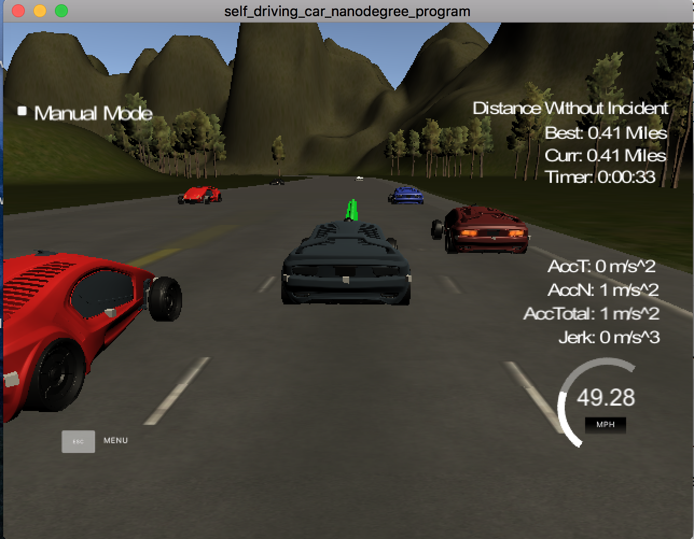

# Project: Path Planning

## 1. Overview
The aim of this project is to safely navigate a car (called the ego car here)
on a highway with other cars so that it can smoothly and safely
change lanes while avoiding collision with the other cars.
Github repository for this project provided by Udacity is available
[here](https://github.com/udacity/CarND-Path-Planning-Project).

## 2. Environment
The simulator of the virtual highway used in this project is provided at the
[website](https://github.com/udacity/self-driving-car-sim/releases/tag/T3_v1.2)
by Udacity. The highway is composed of three lanes in
each direction and other cars are running.
The total distance is 6945.554 meters (about 4.32 miles).
Each lane is 4-meter in width. During single time step, the time elapse is 0.02 second.

In this project, a path planning code is implemented such that

- The ego car drives with speed less than 50 MPH.
- Max acceleration is 10 m/s^2 (about 22.4 MPH/s) and max jerk is 10 m/s^3 (about 22.4 MPH/s^2).
- The ego car does not collide with other cars.
- The ego car does not spend more than 3 seconds outside the lane during the change
of the lane. Except for the occasion of the change of the lane, the ego car
stays in one of the three lanes on the right side of the road.
- The ego car can smoothly change the lane in the case when it is
behind a slow car and an adjacent lane is clear.

The ego car must satisfy the above conditions and drive smoothly at least 4.32 miles.  
An example of an image from a time step of the simulator can be seen below:

## 3. Contents
The contents of this repository are as follows:

- `src`: This folder contains the codes for the path planning.
In particular, `main.cpp` includes my implementation for this project and `spline.h`
is used for generating a spline in `main.cpp`.
- `install-mac.sh`, `install-ubuntu.sh`: These scripts are used for installing uWebSockets
(see the next section).
- `data/highway_map.csv`: This file contains a list of way
points that go all along the highway in the simulator.
- `CMakeLists.txt`, `cmakepatch.txt`: Files for cmake (unchanged from those originally provided
  by Udacity).
-  `README.md`: This markdown file.
- `image`: This folder contains image files used for this markdown.
- `LICENSE`: License description (MIT License).

## 4. Dependencies and Instruction
This part explains the dependencies for this project
and how to play with the codes in this repository.
For further detail, please refer to the
[original repository](https://github.com/udacity/CarND-Path-Planning-Project)
by Udacity.

### 4.1. Dependencies
For this project, the followings need to be installed:
- cmake >= 3.5
- make >= 4.1
- gcc/g++ >= 5.4
- [uWebSockets](https://github.com/uWebSockets/uWebSockets) (run `install-mac.sh`
  or `install-ubuntu.sh` for install.)

### 4.2. Instruction
To run the code in this repository, follow the steps below:

1. Download the simulator from [here](https://github.com/udacity/self-driving-car-sim/releases/tag/T3_v1.2)
and launch it.
2. Clone this repository: `git clone [this repository]`
3. Move to the directory for the cloned repository and make a directory named `build` and go there:  `mkdir build && cd build`
4. Compile: `cmake .. && make`
5. Run the execution file: `./path_planning`
6. Choose `Project 1: Path Planning` in the simulator and click `SELECT`
7. Use `esc` key to stop the simulator, use `ctrl C` to stop running the execution file.

## 5. Implementation for Path Planning
Here I summarize some key components of my implementation
for the path planning in the C++ file `src/main.cpp`:

- To determine the target lane (the lane to move/stay) and acceleration of the ego car
so that it can drive safely and efficiently,
it is important to check if there are any other cars around the ego car.
Depending on the situation of the nearby cars, the target
lane and the acceleration are set as follows (please refer to
line 417-499 (main part) and line 226-284 (some functions used in the main part) of `src/main.cpp`):
  - If there are no other cars within 30 meters ahead (in Frenet's s-coordinate) of the ego car on the same lane,
    stay the lane and set the acceleration to the maximum value (set to 22 MPH/s).
  - In case, there are any other cars within 30 meters ahead on the same lane,
    - if the left lane is available and there is no car there (within 30 meters ahead and 15 meters behind the ego car), then set the target lane to be the left lane
    and the acceleration to the maximum value,
    - if the right lane is available and there is no car there (within 30 meters ahead and 15 meters behind the ego car), then set the target lane to be the right lane
    and the acceleration to the maximum value,
    - otherwise, stay in the same lane. If the lane speed (= average speed of the other cars within 30m ahead of the ego car) is faster than the speed of the ego car, set the acceleration to the maximum value. If the average speed is slower, then decrease the
    acceleration by subtracting 80% of the maximum value of the acceleration. If not, do not change the acceleration.

  - After this, the speed of the ego car is updated by adding the determined acceleration times 0.02 second. In case the updated speed exceeds the maximum speed (set to 49 MPH), set the speed to the maximum value instead.

- Once the target lane is determined, to realize a smooth path, the way points are generated as follows
(please refer to line 502-620 of `src/main.cpp`):
  - Target points are set to three points located at the center of the target lane determined above, 30 m, 60 m, 90 m ahead for the ego car in Frenet s-coordinate. (line 504-560)
  - Based on the three target points and the final two way points in the previous path,
  a spline is generated. (In case there is only one
  or no way point in the previous path, the two points are generated based on the localization data.) For generating the spline, `spline.h` (downloaded from [here](https://kluge.in-chemnitz.de/opensource/spline/)) is used. (line 562-579)
  - Based on this spline, new path way points are generated. More concretely, the euclidean distance is
    first computed between the ego car and a point 30-meter away in the x-direction along the generated
    spline. Then by dividing this by the distance the ego car move in a single time step
    (= speed of the ego car times 0.02 second), the number of the segmentation
    points, N, is computed. Then the candidates of the new way points are generated as the points
    along the spline in every 30/N meters away from the ego car in the x-direction.
    To generate a set of the way points
    for the new path, the points from the previous path are first stored. Then the generated new way
    points are added until the total number of the points reaches 50.
    (line 581-620)

## 6. Performance and Reflection
The performance of my implementation for the path planning is
recorded and available at [Youtube](https://youtu.be/9hkchtCX93A). As can be seen in this video,
with my implementation, the car satisfies the conditions given in Section 2
and drives smoothly without any incidents for more than 4.32 miles
(the recording of this video is stopped at 6 miles but the ego car drove
for more than 10 miles without any incident).

For future improvements, it would be worthwhile to do the followings:

- It is worthwhile to evaluate the average speed of the other cars behind the ego car
and that for the cars in front of the ego car separately. This information will be helpful to
tune the acceleration more finely.
- In the current implementation, when the ego car changes the lane, if both left and
right lanes are available, the ego car automatically selects the left lane. It will be meaningful
to take into account extra information (for example, average speed of the other cars ahead on the
left/right lane, number of the other cars ahead on the left/right lane)
and to decide whether the ego car is better to left or right based on it.
